# Unit Registration Notifier Setup Guide

## Overview

The Unit Registration Notifier automatically checks every 6 hours if units are available for registration and sends you notifications via:
- ✉️ **Email** - Instant email notification
- 📋 **GitHub Issues** - Creates an issue in your repository
- 📊 **Workflow Status** - View in GitHub Actions

---

## Setup Instructions

### Step 1: Configure Email Notifications (Optional but Recommended)

To receive email notifications, you'll need a Gmail account (or any SMTP service).

#### Using Gmail:

1. **Enable 2-Factor Authentication** on your Gmail account
   - Go to https://myaccount.google.com/security
   - Enable 2-Step Verification

2. **Create an App Password**:
   - Go to https://myaccount.google.com/apppasswords
   - Select "Mail" and "Other (Custom name)"
   - Name it "MMU Bot"
   - Copy the 16-character password

3. **Add GitHub Secrets**:
   Go to your repository → Settings → Secrets → Actions → New repository secret

   Add these secrets:

   | Secret Name | Value | Example |
   |-------------|-------|---------|
   | `EMAIL_USERNAME` | Your Gmail address | `yourname@gmail.com` |
   | `EMAIL_PASSWORD` | The 16-char app password | `abcd efgh ijkl mnop` |
   | `NOTIFICATION_EMAIL` | Email to receive notifications | `yourname@gmail.com` |

---

### Step 2: Enable GitHub Issues Notifications

GitHub Issues are created automatically - no setup needed! The bot will:
- ✅ Create a new issue when units become available
- ✅ Add updates if units remain available
- ✅ Label issues with `unit-registration`

To disable GitHub Issues notifications:
- Remove the "Create GitHub Issue" step from the workflow file

---

### Step 3: Test the Workflow

**Option A: Wait for scheduled run** (every 6 hours)

**Option B: Trigger manually**:
1. Go to `Actions` tab
2. Click `Unit Registration Checker`
3. Click `Run workflow` → `Run workflow`
4. Wait 2-3 minutes for completion

---

## How It Works

```mermaid
flowchart TD
    A[GitHub Actions Triggers] --> B[Run Headless Browser]
    B --> C[Login to MMU Portal]
    C --> D[Navigate to Unit Registration]
    D --> E[Select Course Registration]
    E --> F[Click Get Units Button]
    F --> G{Error Detected?}
    G -->|Yes| H[Log Error & Exit]
    G -->|No| I{Check for Checkboxes/Units}
    I -->|Found| J[✅ Units Available!]
    I -->|Not Found| K[❌ No Units Yet]
    J --> L[Send Email]
    J --> M[Create GitHub Issue]
    J --> N[Log Success]
    K --> O[Log Status]
```



---

## Notification Examples

### Email Notification

When units are available, you'll receive:

```
Subject: 🎓 MMU Units Available for Registration!

✅ Units Can Be Registered!

Status: 5 units available with checkboxes.
Unit Count: 5
Time: 2026-02-01 16:00:00

Available Units:
["CIT 101 | Introduction to Computing",
 "CIT 102 | Programming Fundamentals", 
 ...]

🔗 Go to Registration Page
```

### GitHub Issue

A new issue will be created:

**Title:** `🎓 Units Available for Registration!`

**Body:**
```markdown
## ✅ Units Can Be Registered!

**Status:** 5 units available with checkboxes.
**Unit Count:** 5
**Checked At:** 2/1/2026, 4:00:00 PM

### Available Units:
...

### Action Required:
1. Go to MMU Student Portal
2. Select registration type
3. Register for units
```

---

## Customizing

### Change Check Frequency

Edit `.github/workflows/unit-registration-checker.yml`:

```yaml
schedule:
  - cron: '0 */6 * * *'  # Every 6 hours
```

**Common schedules:**
- Every 3 hours: `'0 */3 * * *'`
- Every hour: `'0 * * * *'`
- Every 12 hours: `'0 */12 * * *'`
- Daily at 8am UTC: `'0 8 * * *'`

### Change Registration Type

Edit `unit_registration_notifier.py`:

```python
# Change from "Course Registration" to "Supplementary" or "Retake"
select_registration_type(driver, "Supplementary")
```

---

## Troubleshooting

### No Email Received

**Check:**
1. Email secrets are set correctly
2. App password (not regular password)
3. Check spam folder
4. View workflow logs for email errors

**Alternative:** Gmail may block automated emails. Consider:
- Using a different email service (Outlook, SendGrid)
- Relying on GitHub Issues instead

### No GitHub Issue Created

**Check:**
1. Workflow has write permissions:
   - Settings → Actions → General → Workflow permissions
   - Select "Read and write permissions"
2. View workflow logs for errors

### Units Available But No Notification

**Check:**
1. The workflow completed successfully
2. View step "Check Unit Registration Status" output
3. Check if `can_register` output is `true`
4. Review notification step logs

---

## Disabling Notifications

### Disable Email:
Comment out or remove the "Send Email Notification" step:

```yaml
# - name: Send Email Notification (Units Available)
#   if: steps.check_units.outputs.can_register == 'true'
#   ...
```

### Disable GitHub Issues:
Comment out the "Create GitHub Issue" step:

```yaml
# - name: Create GitHub Issue (Units Available)
#   ...
```

### Keep Only Logs:
The workflow will still check and log results, viewable in Actions tab

---

## Viewing Results

### In GitHub Actions:

1. Go to `Actions` tab
2. Click on latest `Unit Registration Checker` run
3. Click on `check-units` job
4. Expand `Check Unit Registration Status` to see output

### Check Unit Status:

Look for:
```
FINAL STATUS:
  Can Register: YES ✅  (or NO ❌)
  Unit Count: 5
  Message: ✅ UNITS CAN BE REGISTERED! ...
```

---

## Privacy & Security

✅ **Secure:**
- Credentials stored in GitHub Secrets (encrypted)
- Runs in isolated GitHub-hosted runner
- No credentials in logs or code

✅ **Private:**
- Email sent only to you
- GitHub Issues only visible to repo collaborators
- Can make repository private

⚠️ **Important:**
- Never commit `.env` file
- Keep repository private if it contains sensitive info
- Rotate secrets if compromised

---

## Cost

**GitHub Actions (Free Tier):**
- 2,000 minutes/month
- Each check takes ~2 minutes
- Running every 6 hours = 4 checks/day = 120 checks/month = ~240 minutes
- **You're well within the free tier! ✅**

**Email:**
- Gmail app passwords are free
- No additional cost

---

## Next Steps

1. ✅ Set up email notifications (recommended)
2. ✅ Test the workflow manually
3. ✅ Wait for first scheduled check
4. ✅ Verify notifications arrive
5. ✅ Adjust schedule if needed

When you receive a notification that units are available:
1. Go to MMU Student Portal immediately
2. Navigate to Unit Registration
3. Select your units (checkboxes will be available)
4. Submit registration

---

**You'll never miss unit registration again! 🎓✨**
